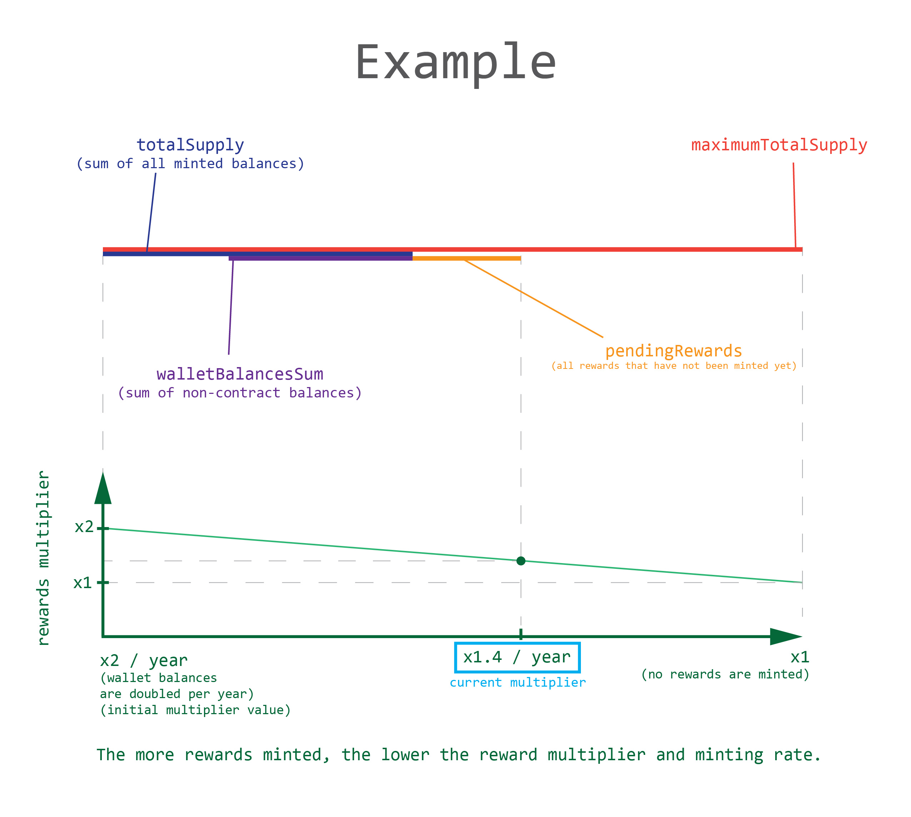

# JUICY TOKEN
Token, that rewards regular (non-contract) holders. Wallets' balances grow over time proportionally to balance amount.
<br>Features:
- Compatible with V3/V4 DEXes
- Compatible with most of DeFi protocols
- Smart contract balances stay constant
- Wallet balances grow over time
- Fixed total supply cap



# CONTRACT DEPLOYED TO BSC TESTNET
https://testnet.bscscan.com/address/0x79656897b7C0BB7a1D0f632012f2E274a1823dCE#code
<br>

# INSTALL DEPENDENCIES

```shell
git clone https://github.com/Vadymykh/JuicyToken.git
```

Enter into the main folder.

```shell
npm install
```

# RUN TEST LOCALLY

```shell
npx hardhat test
```

# CONFIGURE THE DEPLOYMENT

Copy and rename `.env.template` to `.env`, open it and then enter your:
1. The private key of the account which will send the deployment transaction
2. BSCSCAN API key
   <br>Adjust the contract deployment settings! `scripts/deploy.ts`


# DEPLOYMENT & VERIFICATION ON BSC TESTNET
Make sure you've set the correct contract settings

```shell
npx hardhat run --network bscTestnet scripts/deploy.ts
```

# DEPLOYMENT & VERIFICATION ON BCS MAINNET
Make sure you've set the correct contract settings

BSC Mainnet:
```shell
npx hardhat run --network bsc scripts/deploy.ts
```